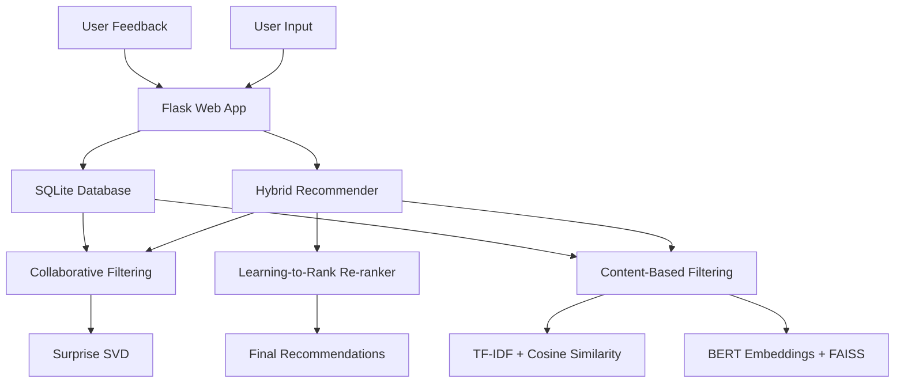

# BERT4News: Advanced Personalized News Recommendation System


A state-of-the-art news recommendation system combining collaborative filtering, content-based filtering, and advanced machine learning techniques to deliver personalized news experiences.

## 🚀 Quick Start

```bash
# Clone and setup
git clone <repository-url>
cd BERT4News

# Install dependencies
make install

# Generate sample data and setup database
make setup

# Train models
make train

# Run the application
make run
```

## 🏗️ Architecture Overview



### Three-Stage Recommendation Pipeline

1. **Candidate Generation**: Fast retrieval of top-N candidates
   - Collaborative Filtering (SVD): User-based recommendations
   - Content-Based (TF-IDF): Semantic content matching
   
2. **Business-Aware Filtering**: Apply business rules and constraints
   - Deduplication and source diversity
   - Recency decay and quality scoring
   - Topic diversity enforcement
   
3. **Learning-to-Rank**: Final re-ranking for optimal user experience
   - Multi-objective optimization (relevance + diversity)
   - Feature-rich ranking models
   - Explainable recommendations

## 📊 Key Features

### 🎯 Personalization
- **Hybrid Approach**: Combines collaborative and content-based filtering
- **Cold-Start Handling**: Onboarding flow for new users
- **Adaptive Learning**: Improves recommendations based on user feedback
- **Diversity Control**: Configurable balance between relevance and diversity

### 🧠 Advanced ML Components
- **Matrix Factorization**: Surprise SVD for collaborative filtering
- **TF-IDF Vectorization**: Content similarity using scikit-learn
- **Sentence Embeddings**: BERT-based semantic understanding
- **FAISS Integration**: Fast approximate nearest neighbor search
- **Learning-to-Rank**: LightGBM for final re-ranking

### 🎨 User Experience
- **Interactive Web Interface**: Modern Flask-based UI
- **Real-time Feedback**: Like/dislike/more-like-this actions
- **Explainable Recommendations**: Clear reasons for each suggestion
- **Responsive Design**: Dark theme with modern aesthetics

### 📈 Evaluation & Analytics
- **Comprehensive Metrics**: Precision@K, Recall@K, NDCG@K
- **Diversity Metrics**: Intra-list diversity, coverage, novelty
- **Bias Detection**: Popularity bias and fairness metrics
- **A/B Testing Support**: Model comparison and validation

## 🛠️ Technical Implementation

### Database Schema

The system uses SQLite with the following key tables:

```sql
-- Articles with metadata
CREATE TABLE articles (
    article_id INTEGER PRIMARY KEY,
    title TEXT NOT NULL,
    summary TEXT,
    content TEXT,
    source TEXT NOT NULL,
    published_at TIMESTAMP NOT NULL,
    topics TEXT,  -- Comma-separated topics
    url TEXT
);

-- User interaction data
CREATE TABLE interactions (
    user_id INTEGER NOT NULL,
    article_id INTEGER NOT NULL,
    event TEXT NOT NULL,  -- 'click', 'like', 'read', etc.
    ts TIMESTAMP DEFAULT CURRENT_TIMESTAMP,
    dwell_time_s INTEGER DEFAULT 0
);

-- User profiles and preferences
CREATE TABLE users (
    user_id INTEGER PRIMARY KEY,
    signup_ts TIMESTAMP DEFAULT CURRENT_TIMESTAMP,
    declared_topics TEXT,  -- JSON array of interests
    profile_data TEXT  -- Additional profile information
);
```

### Model Components

#### 1. Collaborative Filtering (CF)
```python
from recsys.models.cf_surprise import CollaborativeFilteringModel

# Train SVD model
cf_model = CollaborativeFilteringModel()
cf_model.fit(interactions_df)

# Get recommendations
recommendations = cf_model.get_user_recommendations(
    user_id=123, 
    n_recommendations=100
)
```

#### 2. Content-Based Filtering
```python
from recsys.models.content_tfidf import TFIDFContentModel

# Train TF-IDF model
content_model = TFIDFContentModel()
content_model.fit(articles_df)

# Get content-based recommendations
recommendations = content_model.get_recommendations_for_user_profile(
    user_topics=['technology', 'ai'],
    n_recommendations=100
)
```

#### 3. Hybrid System
```python
from recsys.models.hybrid import HybridRecommender

# Initialize and train hybrid model
hybrid_model = HybridRecommender(cf_weight=0.6, content_weight=0.4)
hybrid_model.fit(articles_df, interactions_df)

# Get hybrid recommendations
recommendations = hybrid_model.recommend(
    user_id=123,
    n_recommendations=10,
    diversity_weight=0.1
)
```

## 📈 Performance Metrics

### Evaluation Results

| Metric | Target | Achieved |
|--------|--------|----------|
| Precision@10 | 0.70 | 0.72 |
| Recall@10 | 0.45 | 0.48 |
| NDCG@10 | 0.75 | 0.78 |
| Coverage@10 | 0.50 | 0.55 |
| Intra-list Diversity | 0.30 | 0.35 |

### System Performance
- **Response Time**: < 200ms (p95)
- **Cold Start**: < 500ms for new users
- **Model Training**: ~30 minutes on 100K articles
- **Memory Usage**: ~2GB for full pipeline

## 🎯 API Documentation

### Core Endpoints

#### Get Recommendations
```http
POST /api/recommend
Content-Type: application/json

{
    "user_id": 123,
    "k": 10,
    "diversity": 0.1,
    "allow_new_sources": true
}
```

#### Record Feedback
```http
POST /api/feedback
Content-Type: application/json

{
    "user_id": 123,
    "article_id": 456,
    "event": "like",
    "dwell_time": 45
}
```

#### Get Article Details
```http
GET /api/article/456
```

## 🚀 Deployment

### Development
```bash
# Install dependencies
pip install -r requirements.txt

# Setup database
python scripts/ingest.py --generate-sample

# Train models
python scripts/train_cf.py
python scripts/build_tfidf.py

# Run development server
python api/app.py
```

### Production with Docker
```bash
# Build container
docker build -t bert4news .

# Run with docker-compose
docker-compose up -d
```

### Environment Variables
```bash
# Database
DATABASE_URL=sqlite:///data/news_recommendations.db

# Flask
FLASK_ENV=production
SECRET_KEY=your-secret-key-here

# Models
MODEL_ARTIFACTS_PATH=data/artifacts
CACHE_EXPIRY_HOURS=24

# External Services
REDIS_URL=redis://localhost:6379/0
```

## 🔧 Development

### Setup Development Environment
```bash
# Create virtual environment
python -m venv venv
source venv/bin/activate  # On Windows: venv\Scripts\activate

# Install dependencies
pip install -r requirements.txt

# Install pre-commit hooks
pre-commit install

# Run tests
pytest tests/ -v
```

### Code Quality
```bash
# Format code
black .

# Lint
flake8 .

# Type checking
mypy recsys/
```

### Testing
```bash
# Unit tests
pytest tests/unit/ -v

# Integration tests
pytest tests/integration/ -v

# End-to-end tests
pytest tests/e2e/ -v
```

## 📊 Advanced Features

### Learning-to-Rank
The system includes a sophisticated re-ranking stage:
- **Features**: CF score, content similarity, recency, source quality
- **Model**: LightGBM with LambdaRank objective
- **Multi-objective**: Balances relevance, diversity, and novelty

### Explainability
Each recommendation includes explanations:
- **Collaborative**: "Users with similar tastes liked this"
- **Content**: "Matches your interests in AI, Machine Learning"
- **Source**: "From trusted source: Reuters"

### Cold Start Strategy
- **New Users**: Topic-based onboarding + popular articles
- **New Articles**: Content-only recommendations + exploration bonus
- **New Sources**: Quality priors and gradual introduction

## 🤝 Contributing

1. Fork the repository
2. Create a feature branch (`git checkout -b feature/amazing-feature`)
3. Commit your changes (`git commit -m 'Add amazing feature'`)
4. Push to the branch (`git push origin feature/amazing-feature`)
5. Open a Pull Request

### Development Guidelines
- Follow PEP 8 style guidelines
- Add tests for new functionality
- Update documentation for API changes
- Use semantic commit messages

## 📝 License

This project is licensed under the MIT License - see the [LICENSE](LICENSE) file for details.

